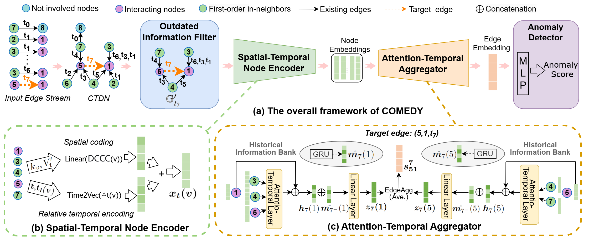

# CADDY: Continuous-time Anomaly Detection in Dynamic Networks
<!--#### -->
## Introduction
Dynamic network serves as an ideal medium for representing the ever-changing interactions among diverse system entities in the real world. Nevertheless, interactions between system entities sometimes manifest abnormal.These anomalous activities often transpire repeatedly within a brief span, causing system malfunction. Hence, a pivotal task in dynamic network analysis is anomaly detection, which aims to identify the nodes, edges, and subgraphs that exhibit notable deviations from the established, conventional or anticipated ones.

In this paper, we propose a novel <u>**C**</u>ontinuous-time <u>**A**<u>nomaly <u>**D**<u>etection framework in <u>**DY**<u>namic networks **(CADDY)**. This model disigns outdated information filter to filters out the outdated information by removing the inactive nodes in the current dynamic network and combines the {\em attention-temporal module} with the {\em historical information bank} for anomaly detection at the finest most natural temporal granularity without loss of information. Moreover, considering the absence of node attributes in dynamic network datasets, we design a comprehensive node coding strategy. This encoding method utilizes node centrality and relative interaction time to represent node features, serving as inputs for downstream neural networks.

 The framework of CADDY consists of four main components: the outdated information filter(blue box), the spatial-temporal encoding (green dotted box), the attention-temporal aggregator (red dotted box), and the anomaly detector (purple dotted box). Within the attention-temporal aggregator, the historical information bank (yellow oval box) is used to store historical interactive information of nodes. 


## Dataset and preprocessing

### Download the public dataset
* [UCI Message](http://konect.cc/networks/opsahl-ucsocial)
  
* [Digg](http://konect.cc/networks/munmun_digg_reply)
  
* [Bitcoin-OTC](http://snap.stanford.edu/data/soc-sign-bitcoin-otc)

* [Bitcoin-Alpha](http://snap.stanford.edu/data/soc-sign-bitcoin-alpha)
 
* [ia-contacts-dublin](https://networkrepository.com/ia-contacts-dublin.php)

* [fb-forum](https://networkrepository.com/fb-forum.php)

## Usage
###  Training the CADDY Dynamic graph neural network
```
python train.py --data uci  --n_epoch 15  --lr 0.1  --hidden_size 32  --node_dim 8  --edge_agg mean  --ratio 0.3 --dropout 0  --anomaly_ratio 0.1  --threshold 10000  --window_size 5
```

## Requirements
* python >= 3.6

* Dependency

```{bash}
torch==1.12.1
networkx==2.7.1
tqdm==4.64.0
numpy==1.24.3
scikit-learn==1.0.2
```

## Command and configurations
### General flags
```{txt}
optional arguments:
  -d DATA, --data DATA                       data sources to use
  --n_epoch N_EPOCH                          number of epochs
  --lr LR                                    learning rate
  --hidden_size HIDDEN_SIZE                  dimensions of the model hidden size
  --node_dim NODE_DIM                        dimensions of the node encoding
  --edge_agg {mean,had,w1,w2,activate}       Edge Aggregator(EdgeAgg) method
  --ratia                                    the ratio of training sets
  --dropout                                  dropout rate
  --anomaly_ratio                            the ratio of anomalous edges in testing set
  --threshold                                inactive nodes threshold
  --window_size                              the queue size of historical information bank
```
